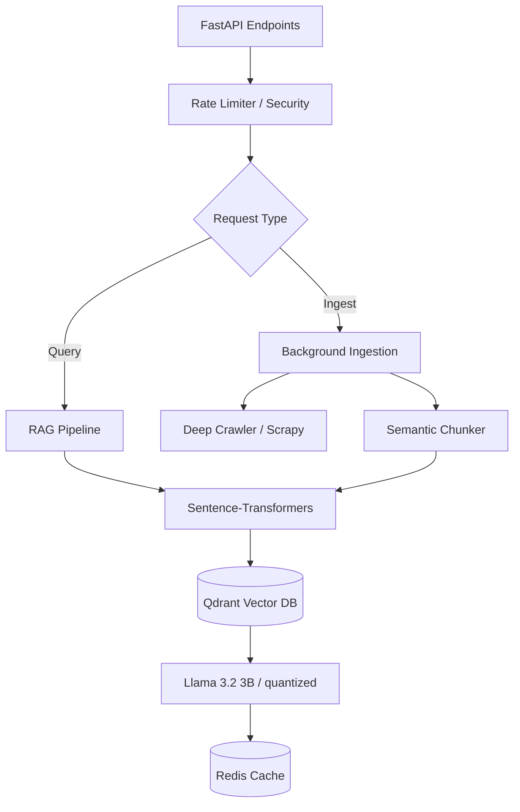

# <div align="center"> Vortex AI Core </div>
<div align="center">
  
  <br>
  <strong>High-Performance Retrieval-Augmented Generation (RAG) Service</strong>
  <br>
  
  
  
  
</div>

---

## 🚀 Overview

The **Vortex AI Core** is a high-concurrency, low-latency microservice built with **FastAPI**. It handles the heavy lifting of knowledge ingestion, semantic embedding, and context-aware generation. Designed for scalability, it integrates seamlessly with **Qdrant** for vector storage and **Redis** for distributed caching.

### Core Objectives:
*   ⚡ **Low-Latency Inference**: Optimized for sub-15s E2E response times.
*   🧠 **Smart Knowledge Ingestion**: Deterministic hashing and recursive web crawling.
*   🛡️ **Production-Ready Security**: Built-in SSRF protection and rate limiting.
*   👨‍🏫 **Tutor-Centric Responses**: Specialized prompting for educational context.

---

## 🏗️ Technical Architecture



---

## ⚡ Low-Latency Design Principles

### 1. Precomputational Strategy
Knowledge chunks are embedded and indexed in **Qdrant** *before* any query occurs. This reduces the query-time overhead to only `Embedding + Retrieval + Inference`.

### 2. Inference Optimization
*   **Model Selection**: Optimized for 4-bit quantized GGUF/HF models (Llama 3.2 3B).
*   **Batching**: Concurrent request handling using Python's `asyncio` and thread pools for CPU-bound tasks.
*   **Persistent Connections**: Pooled connections for Redis and Qdrant to minimize handshake latency.

### 3. Distributed Caching (Redis)
Caches both the **Retrieved Context** and the **Final Answer** for frequent queries, slashing response time from seconds to milliseconds.

---

## ⚙️ Installation & Development

### Local Setup
1.  **Environment**:
    ```bash
    python -m venv venv
    source venv/bin/activate  # atau venv\Scripts\activate pada Windows
    pip install -r requirements.txt
    ```

2.  **Configuration**:
    Create a `.env` file from `.env.example`:
    ```dotenv
    MODEL_PATH=./models/llama-3.2-3b-q4.gguf
    QDRANT_HOST=localhost
    REDIS_HOST=localhost
    ```

3.  **Run Service**:
    ```bash
    # Debug Mode
    uvicorn main:app --reload --port 8000
    
    # Production Mode (Multi-worker)
    uvicorn main:app --host 0.0.0.0 --port 8000 --workers 4
    ```

---

## 📡 API Reference

### `POST /query`
Main RAG endpoint for student/user questions.
*   **Payload**: `{ "text": "What is React hooks?", "user_id": "123" }`
*   **Security**: Rate-limited and prompt-injection-sanitized.

### `POST /upload-doc`
Handles PDF, DOCX, and TXT ingestion.
*   **Process**: File Validation → Chunking → Embedding → Upsert to Qdrant.

### `POST /upload-url`
Recursive web crawler for educational site ingestion.
*   **Process**: Deep Scrape (Lvl-1) → Content Sanitization → Vectorization.

---

## 🔐 Security Standards

> [!IMPORTANT]
> The AI Core implements strict validation to prevent common RAG vulnerabilities.

*   **File Sanitization**: Strict mime-type checks for all uploads.
*   **URL Whitelisting**: Prevents SSRF through malicious link ingestion.
*   **Context Isolation**: Ensures users only retrieve context from relevant knowledge partitions.

---

## 🛠️ Project Structure

```text
Aiservice/
├── main.py            # FastAPI Entry Point
├── config.py          # Global Configuration
├── ingestion/         # Scraping & Doc Parsing Logic
│   ├── web_scraper.py
│   └── chunker.py
├── vectorstore/       # Qdrant & Embedding Integration
├── rag/               # Prompt Engineering & LLM Interface
├── security/          # Rate-limiting & SSRF Protection
└── cache/             # Redis Client Implementation
```

---

<p>
  Developed by <strong>Vennilavan Manoharan</strong> • 2026
</p>

<p align="center">
<strong>Vortex AI Core </strong> — Powering the Future of Agentic Learning.
</p>