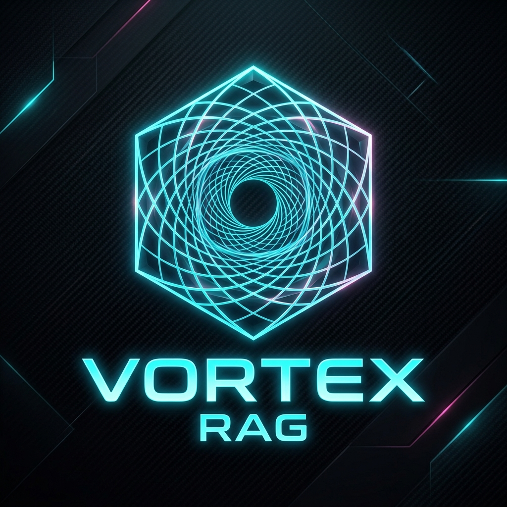
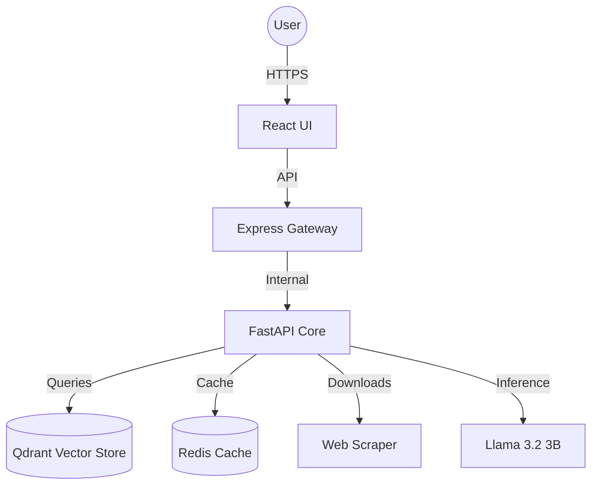

# <div align="center"> Vortex RAG </div>
<div align="center">
  
  <br>
  <strong>A High-Performance AI Tutor & Knowledge Ingestion Engine</strong>
  <br>
  
  
  
  
  
</div>

<div align="center">
  <span>⚡ Low-Latency</span> | <span>🧠 Context-Aware</span> | <span>🛡️ Enterprise-Secure</span> | <span>🎨 Cyber-Noir UI</span>
</div>

---

## 🌌 Overview

**Vortex RAG** is a production-grade Retrieval-Augmented Generation (RAG) ecosystem designed for high-speed, secure, and intelligent knowledge interaction. Built on a distributed microservices architecture, it empowers users to transform raw documents (PDFs, DOCX, TXT) and web URLs into a structured, queryable AI knowledge base.

With an aesthetic focus on **"Cyber-Refined Noir"**, the platform provides a premium, immersive experience for students, developers, and researchers alike.

---

## ✨ AI-Assisted Development

This project was developed using modern AI-assisted development workflows (including **Antigravity**) to accelerate prototyping, UI refinement, and complex system orchestration. While AI tools were used to streamline implementation and optimize code pathways, the core system architecture, service integration, and engineering decisions were architected and implemented by the developer.

The platform follows a sophisticated microservice-based architecture, integrating a **Node.js (Express)** gateway with a **Python (FastAPI)** AI core powered by **Llama 3.2 3B**, **Qdrant Vector DB**, and **Redis**.

---

## 🚀 Key Features

*   **🧠 Intelligent Ingestion**: Level-1 deep crawling for websites and multi-format document parsing.
*   **⚡ Sub-15s Response**: Optimized inference pipeline and connection pooling for rapid AI tutoring.
*   **🏗️ Microservices Architecture**: 
    *   **AI Service (FastAPI)**: Core RAG engine with Llama 3.2 3B.
    *   **Gateway (Node.js/Express)**: Secure integration and file handling.
    *   **UI (React/Vite)**: Stunning retro-futuristic interaction layer.
*   **🗄️ Vector Intelligence**: Persistent storage with **Qdrant** for high-precision semantic retrieval.
*   **🛡️ Secure-by-Design**: Integrated Rate Limiting, SSRF protection, and prompt injection mitigation.
*   **🔄 Deterministic Hashing**: Avoid redundant data ingestion with incremental knowledge updates.

---

## 🛠️ Technology Stack

| Layer | Technology |
| :--- | :--- |
| **Frontend** | React, Vite, Tailwind CSS, Framer Motion |
| **Gateway** | Node.js, Express.js, Axios, Multer |
| **AI Core** | Python, FastAPI, Llama 3.2 3B (GGUF/HF) |
| **Vector DB** | Qdrant |
| **Cache** | Redis |
| **Deployment** | Docker, Docker Compose |

---

## 🏗️ Architecture



---
<p>
For detailed Ai Architecture ,Go inside Aiservice and you can view the full Arch
</p>

## 🏁 Getting Started

### Prerequisites

*   [Docker](https://www.docker.com/) & Docker Compose
*   Python 3.9+ (for local AI development)
*   Node.js 18+ (for local frontend/backend development)

### Quick Start with Docker

1.  **Clone the Repository**
    ```bash
    git clone https://github.com/vortex-rag.git
    cd Vortex_Rag
    ```

2.  **Environment Configuration**
    Create `.env` files in `Aiservice/`, `Backend/`, and `Frontend/` using the provided `.env.example` templates.

3.  **Launch All Services**
    ```bash
    docker-compose up --build -d
    ```

4.  **Access the Dashboard**
    -   Frontend: `http://localhost:8080`
    -   API Documentation: `http://localhost:8000/docs`

---

## 🔐 Security & Optimization

> [!IMPORTANT]
> Vortex RAG is built for performance. To ensure optimal speed, use **4-bit quantized GGUF models** for the AI Core.

*   **Rate Limiting**: Integrated `slowapi` in Python and Express-rate-limit in the Gateway.
*   **Caching**: Redis-backed query and context caching for sub-millisecond response on repeated questions.
*   **Vector Search**: Optimized top-k retrieval (k=3-5) for minimal context injection.

---

## 🎨 Design Ethics

The UI follows a **"Cyber-Refined Noir"** aesthetic:
-   **Typography**: Orbitron (Headers), Space Mono (Code/Body).
-   **Palette**: Carbon Black (#050505), Neon Cyan (#00ffff), Neon Pink (#ff00ff).
-   **Interactions**: Scanline animations, glassmorphic cards, and neon-glow transitions.

## 📄 License

This project is licensed under the MIT License - see the [LICENSE](LICENSE) file for details.

---

<p>
  Developed by <strong>Vennilavan Manoharan</strong> • 2026
</p>

<p align="center">
Built with ❤️ for the next generation of AI-powered learning.
</p>
